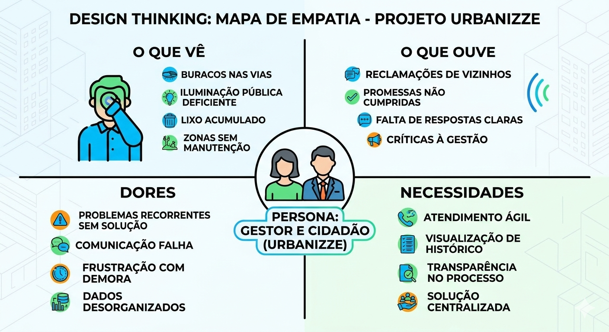

# Introdução

O projeto Urbanizze surge como uma iniciativa tecnológica voltada para a modernização da gestão de infraestrutura e serviços em contextos urbanos e comunidades planejadas. Em um cenário de crescimento acelerado das cidades, a manutenção de ativos públicos e o atendimento a demandas de zeladoria tornam-se desafios logísticos complexos.

Esta documentação apresenta a visão geral de uma plataforma projetada para integrar a comunicação entre usuários e gestores, estabelecendo objetivos claros de eficiência operacional e transparência. O projeto justifica-se pela necessidade de transformar processos tradicionalmente manuais em fluxos digitais auditáveis, tendo como público-alvo gestores públicos, administradores de condomínios e cidadãos engajados na melhoria do seu entorno.

## Problema
A gestão de manutenção urbana e predial enfrenta obstáculos críticos que impactam diretamente a qualidade de vida e a segurança dos usuários. O problema central reside na fragmentação e na informalidade do fluxo de informações. Atualmente, a identificação de falhas na infraestrutura — como problemas de iluminação, pavimentação ou saneamento — depende de processos reativos e, muitas vezes, sem registros centralizados.

Contexto
O cenário identificado envolve a utilização de canais de comunicação ineficientes (como ligações telefônicas isoladas ou mensagens informais), o que resulta em:

Perda de Rastreabilidade: Não há um histórico confiável sobre quando um problema foi reportado ou quem foi o responsável pela última intervenção.

Gargalos de Priorização: Sem dados consolidados, gestores não conseguem identificar quais áreas demandam atenção urgente, baseando-se em percepções subjetivas em vez de indicadores reais.

Desperdício de Recursos: A falta de planejamento preventivo, causada pela ausência de visão sistêmica, gera custos elevados com manutenções corretivas de emergência.

Neste contexto, as organizações (sejam prefeituras ou empresas de gestão patrimonial) operam com tecnologias limitadas a planilhas eletrônicas estáticas que não oferecem suporte à mobilidade ou à atualização em tempo real, dificultando a resolução ágil de incidentes que ocorrem dinamicamente no espaço urbano.

### Análise do Problema

Como parte do processo de entendimento profundo das dores dos usuários, o grupo realizou uma dinâmica de Design Thinking. O resultado está sintetizado no **Mapa de Empatia** abaixo, que destaca a frustração com os canais de comunicação ineficientes e a falta de rastreabilidade das demandas de infraestrutura urbanas.

  

> **Links Úteis**:
> - [Objetivos, Problema de pesquisa e Justificativa](https://medium.com/@versioparole/objetivos-problema-de-pesquisa-e-justificativa-c98c8233b9c3)
> - [Matriz Certezas, Suposições e Dúvidas](https://medium.com/educa%C3%A7%C3%A3o-fora-da-caixa/matriz-certezas-suposi%C3%A7%C3%B5es-e-d%C3%BAvidas-fa2263633655)
> - [Brainstorming](https://www.euax.com.br/2018/09/brainstorming/)

## Objetivos
O objetivo da plataforma de denúncia de problemas urbanos (Urbanizze), é promover a participação dos cidadãos na identificação e resolução de falhas presentes no espaço urbano, como problemas de mobilidade, saneamento, iluminação pública e segurança, contribuindo diretamente para a garantia dos direitos humanos básicos.
A proposta está alinhada aos princípios defendidos pelo ONU-Habitat, que busca cidades mais inclusivas, seguras e sustentáveis, assegurando que todos os cidadãos tenham acesso a condições dignas de vida. Dessa forma, a plataforma funcionará como um canal direto entre a população e o poder público, fortalecendo a transparência, a cidadania ativa e o direito à cidade.

Além disso, o sistema pretende facilitar a coleta de dados urbanos, contribuindo para a criação de políticas públicas mais eficientes e baseadas em evidências, como já defendido por iniciativas que integram dados urbanos no Brasil. 

## Justificativa

ENo cotidiano das cidades brasileiras, é comum que a população enfrente diversos problemas urbanos, como ruas esburacadas, falta de saneamento básico, transporte público precário e acúmulo de lixo. Esses problemas impactam diretamente a qualidade de vida e representam, muitas vezes, violações de direitos humanos fundamentais.
Por exemplo, dados mostram que mais de 34 milhões de brasileiros não têm acesso à água potável, evidenciando uma grave deficiência estrutural no país. Esse cenário demonstra como questões urbanas estão diretamente ligadas à dignidade humana e à saúde pública.
Além disso, a mobilidade urbana e a infraestrutura das cidades continuam sendo desafios significativos, afetando diretamente o acesso da população a serviços essenciais, trabalho e educação, e reforçando desigualdades sociais.

Outro fator relevante que motiva a criação desta plataforma é a recente tragédia provocada pelas fortes chuvas nas cidades de Ubá e Juiz de Fora, em Minas Gerais. Os alagamentos, deslizamentos e danos estruturais observados nessas regiões evidenciam a fragilidade de muitos centros urbanos diante de eventos climáticos intensos, frequentemente agravados pela falta de planejamento urbano, manutenção preventiva e canais eficientes de comunicação entre a população e o poder público.
Situações como essa não são casos isolados. Diversas cidades brasileiras apresentam riscos semelhantes, ainda que em menor escala. Problemas como bueiros entupidos, lixo acumulado em vias públicas e falhas na drenagem urbana, muitas vezes ignorados no dia a dia, podem se transformar em grandes tragédias quando associados a eventos climáticos extremos.

Diante desse contexto, a criação de uma plataforma de denúncias se justifica como uma ferramenta essencial para dar voz à população, permitindo o registro de problemas reais vivenciados no cotidiano e possibilitando ações preventivas. Com a participação ativa dos cidadãos, torna-se possível identificar riscos antes que se agravem, contribuindo para soluções mais rápidas e eficazes.
Portanto, a plataforma não apenas facilita a comunicação entre cidadãos e governo, mas também atua como um instrumento de prevenção, auxiliando na redução de danos, na promoção da segurança urbana e na garantia de direitos fundamentais, especialmente em um cenário de crescentes desafios urbanos e climáticos.

 Referências
•	ONU Brasil. IBGE e ONU-Habitat iniciam parceria para fortalecer uso de dados em cidades brasileiras. Disponível em: https://brasil.un.org 
https://brasil.un.org/pt-br/302229-ibge-e-onu-habitat-iniciam-parceria-para-fortalecer-uso-de-dados-em-cidades-brasileiras

•	SEMOVE / ONU-Habitat. Mobilidade urbana é considerada o principal desafio das cidades. 
https://semove.org.br/noticias/mobilidade-urbana-e-considerada-como-principal-desafio-das-cidades-para-44-dos-brasileiros/?utm_source=chatgpt.com

•	((o))eco. ONGs denunciam Brasil à ONU por violar direito à água e saneamento. 
https://oeco.org.br/salada-verde/ongs-denunciam-brasil-a-onu-por-violar-direito-a-agua-e-ao-saneamento/?utm_source=chatgpt.com

•	ONU-Habitat – Programa das Nações Unidas para Assentamentos Humanos
https://www.un.org/en/global-issues/human-settlements

•	Ouvidoria Nacional de Direitos Humanos – Canal oficial de denúncias no Brasil

## Público-Alvo

O público-alvo da plataforma Urbanizze é composto principalmente por cidadãos que desejam reportar problemas urbanos em suas cidades de forma simples e rápida, como buracos nas ruas, falta de iluminação pública, lixo acumulado e outros problemas que afetam o dia a dia da população. Por meio da plataforma, esses usuários podem registrar denúncias, descrever o problema e acompanhar o andamento da solicitação.

Além disso, a plataforma também é voltada para funcionários e gestores das prefeituras, que serão responsáveis por analisar os chamados, encaminhá-los para os departamentos adequados e atualizar o status das solicitações. Dessa forma, o Urbanizze contribui para melhorar a comunicação entre a população e a prefeitura, tornando a gestão de problemas urbanos mais organizada e transparente.
