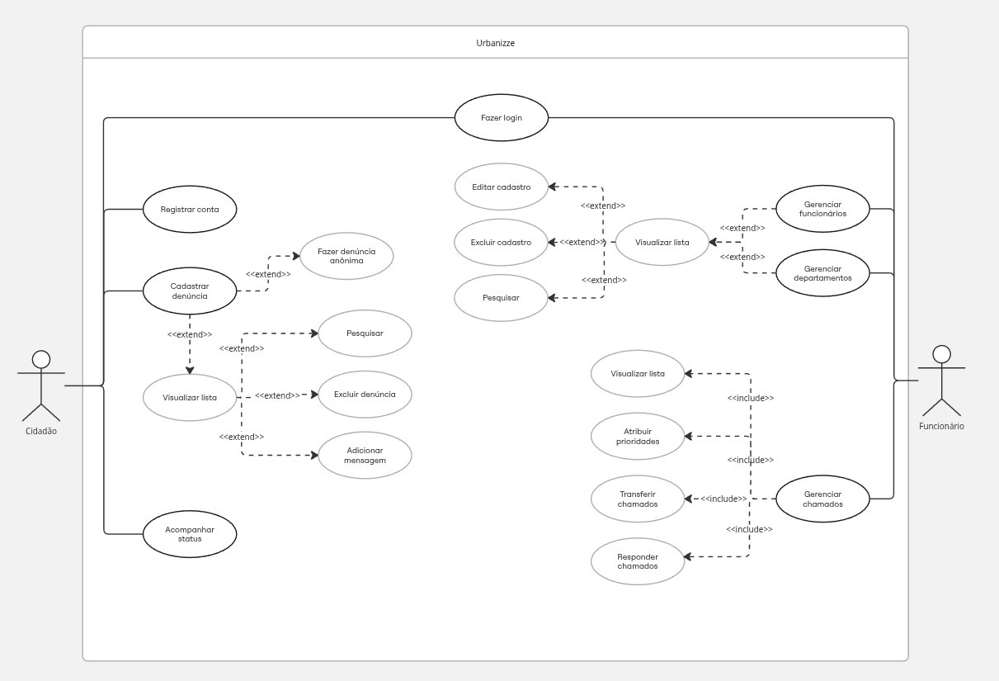

# Especificações do Projeto

O Urbanizze será uma plataforma digital desenvolvida com o objetivo de facilitar a comunicação entre a população e as prefeituras, permitindo o registro e acompanhamento de problemas urbanos. O sistema permitirá que cidadãos cadastrem ocorrências relacionadas à infraestrutura da cidade, como buracos em vias, falta de iluminação pública, lixo acumulado e outros problemas urbanos.

A plataforma contará com um sistema de cadastro de usuários, onde cidadãos poderão registrar e acompanhar denúncias. Também haverá acesso para funcionários da prefeitura, que serão responsáveis por analisar as denúncias, atualizar o status das denúncias e encaminhá-los aos departamentos responsáveis pela resolução.

O sistema contará com funcionalidades de gerenciamento de prefeituras, departamentos e funcionários, além de um módulo de controle de denúncias, contendo informações como título, descrição, status, respostas e histórico de interações entre cidadãos e prefeitura.

O desenvolvimento da plataforma incluirá um front-end para interação com os usuários, um back-end para processamento das informações e um banco de dados para armazenamento das informações do sistema, garantindo organização e controle das solicitações registradas.

## Personas

As personas, ou seja, os usuários ideais do site foram definidos abaixo:

Persona 1: João Silva – Morador Engajado
Idade: 47 anos
Profissão: Motorista de ônibus
Local: Bairro residencial periferia
Características pessoais: Dedicado à vizinhança, lidera o grupo de WhatsApp do bairro, sempre tenta ajudar os outros.

Persona 2: Maria Fernanda – Jovem Universitária
Idade: 21 anos
Profissão: Estudante de Engenharia Ambiental
Local: Centro urbano
Características pessoais: Tecnológica, conectada às redes sociais, preocupada com questões ambientais.

Persona 3: Anderson Souza – Funcionário da Prefeitura
Idade: 35 anos
Profissão: Técnico em obras públicas
Local: Sede da prefeitura municipal
Características pessoais: Organizado, comprometido, sente-se pressionado pela cobrança pública.

Persona 4: Renata Torres – Mãe Solo Trabalhadora
Idade: 29 anos
Profissão: Caixa de supermercado
Local: Região metropolitana
Características pessoais: Responsável, cheia de tarefas diárias, precisa de soluções rápidas e práticas.

## Histórias de Usuários

Com base na análise das personas forma identificadas as seguintes histórias de usuários:

| EU COMO... `PERSONA` | QUERO/PRECISO ... `FUNCIONALIDADE`                               | PARA ... `MOTIVO/VALOR`                                                                                     |
| -------------------- | ---------------------------------------------------------------- | ----------------------------------------------------------------------------------------------------------- |
| João Silva           | Registrar uma denúncia sobre buracos nas ruas pelo celular       | Evitar danos ao meu veículo e promover mais segurança no bairro veículo e promover mais segurança no bairro |
| João Silva           | Acompanhar o andamento da denúncia por status                    | Saber se o problema do bairro está sendo tratado                                                            |
| Maria Fernanda       | Anexar fotos à minha denúncia de descarte irregular de lixo      | Facilitar o entendimento e a solução do problema pelos responsáveis                                         |
| Maria Fernanda       | Filtrar e pesquisar denúncias                                    | Monitorar problemas ambientais da minha região e cobrar soluções                                            |
| Renata Torres        | Fazer denúncia rapidamente, sem muitos cadastros                 | Não perder tempo no meu dia corrido e ainda melhorar a vizinhança                                           |
| Renata Torres        | Fazer denúncia anonimamente                                      | Não sofrer represálias caso o problema envolva vizinhos ou conhecidos                                       |
| Anderson Souza       | Receber denúncias detalhadas e organizadas por setor             | Atender demandas com mais eficácia e menos retrabalho                                                       |
| Anderson Souza       | Ter histórico/auditoria completa das interações em cada denúncia | Garantir transparência e poder mostrar a evolução das demandas públicas                                     |
| Anderson Souza       | Delegar e transferir denúncias entre departamentos               | Garantir que cada problema seja tratado pela equipe correta                                                 |

## Requisitos

As tabelas que se seguem apresentam os requisitos funcionais e não funcionais que detalham o escopo do projeto.

### Requisitos Funcionais

| ID    | Descrição do Requisito                                      | Prioridade |
| ----- | ----------------------------------------------------------- | ---------- |
| RF-01 | Gerenciar cadastro de cidadãos                              | ALTA       |
| RF-02 | Cidadão/funcionário realizar login                          | ALTA       |
| RF-03 | Cidadão/funcionário recuperar senha                         | ALTA       |
| RF-04 | Gerenciar prefeituras/cidades                               | ALTA       |
| RF-05 | Gerenciar departamentos                                     | ALTA       |
| RF-06 | Gerenciar funcionários                                      | ALTA       |
| RF-07 | Gerenciar denúncias                                         | ALTA       |
| RF-08 | Adicionar fotos/anexos a denúncia                           | MÉDIA      |
| RF-09 | Realizar interações dentro da denúncia (envio de mensagens) | ALTA       |
| RF-10 | Diferenciar perfis de acesso: cidadão e funcionário         | ALTA       |
| RF-11 | Notificar cidadão/funcionário                               | ALTA       |
| RF-12 | Permitir pesquisas e filtros de denúncias                   | MÉDIA      |
| RF-13 | Permitir pesquisas e filtros de funcionários                | BAIXA      |

### Requisitos não Funcionais

| ID     | Descrição do Requisito                                                                                                                                          | Prioridade |
| ------ | --------------------------------------------------------------------------------------------------------------------------------------------------------------- | ---------- |
| RNF-01 | O site deverá ter uma disponibilidade 24/7.                                                                                                                     | ALTA       |
| RNF-02 | O site deve ser compatível com os principais navegadores do mercado (Google Chrome, Firefox, Opera).                                                            | ALTA       |
| RNF-03 | A interface deve ser agradável, intuitiva, de fácil utilização para o usuário e deve ser organizado de tal maneira que os erros dos usuários sejam minimizados. | MÉDIA      |
| RNF-04 | O site deve ser publicado em um ambiente acessível publicamente na Internet.                                                                                    | ALTA       |
| RNF-05 | Utilizar símbolo e ícone para ajudar no entendimento e conseguir uma associação imediata sobre aplicações de reconhecimento.                                    | MÉDIA      |
| RNF-06 | A aplicação ou parte dela deve ser acessível por pessoas com certo tipo de deficiência ou outra necessidade específica.                                         | ALTA       |

## Restrições

O projeto está restrito pelos itens apresentados na tabela a seguir.

| ID    | Restrição                                                                |
| ----- | ------------------------------------------------------------------------ |
| RE-01 | O projeto deverá ser entregue até o final do semestre                    |
| RE-02 | A equipe não pode contratar terceiros para o desenvolvimento do projeto. |

## Diagrama de Casos de Uso

O diagrama de casos de uso é o próximo passo após a elicitação de requisitos, que utiliza um modelo gráfico e uma tabela com as descrições sucintas dos casos de uso e dos atores. Ele contempla a fronteira do sistema e o detalhamento dos requisitos funcionais com a indicação dos atores, casos de uso e seus relacionamentos.

As referências abaixo irão auxiliá-lo na geração do artefato “Diagrama de Casos de Uso”.

  

> **Links Úteis**:
>
> - [Criando Casos de Uso](https://www.ibm.com/docs/pt-br/elm/6.0?topic=requirements-creating-use-cases)
> - [Como Criar Diagrama de Caso de Uso: Tutorial Passo a Passo](https://gitmind.com/pt/fazer-diagrama-de-caso-uso.html/)
> - [Lucidchart](https://www.lucidchart.com/)
> - [Astah](https://astah.net/)
> - [Diagrams](https://app.diagrams.net/)

---

2 historias de usuarios por cada persona

## Gerenciamento de prefeituras - apenas uma visualização de algumas telas, para listar todos os chamados daquela prefeitura/cidade - ver se seria mais adequado chamar de cidades

## Verificar se o requisito funcionário realizar login deve ser um novo requisito ou se deve estar junto com o RF-02

---

Ver se isso seria funcionalidade nova ou se entra na questao de resposta dentro do chamado
Permitir registro obrigatório de justificativa ao rejeitar, reclassificar ou encerrar chamado.

| RF-01 | Permitir cadastro de cidadão com dados obrigatórios e validação básica de campos. | ALTA |
| RF-02 | Permitir autenticação de cidadão por e-mail e senha para acesso à área do usuário. | ALTA |
| RF-03 | Permitir cadastrar, consultar, editar e ativar/inativar prefeituras no sistema. | ALTA |
| RF-04 | Permitir cadastrar, consultar, editar e ativar/inativar departamentos por prefeitura. | ALTA |
| RF-05 | Permitir cadastrar, consultar, editar e desativar funcionários vinculados a setores. | ALTA |
| RF-06 | Permitir ao cidadão abrir chamado de denúncia urbana com título, descrição e endereço. | ALTA |
| RF-07 | Permitir ao cidadão acompanhar o andamento dos seus chamados por status. | ALTA |
| RF-08 | Permitir ao cidadão registrar denúncia em modo anônimo, sem exibir sua identidade. | ALTA |
| RF-09 | Permitir encaminhar e transferir chamados entre departamentos, mantendo o responsável. | ALTA |
| RF-10 | Permitir classificar chamados por prioridade (baixa, média, alta) conforme urgência. | MÉDIA |
| RF-11 | Registrar histórico de movimentações do chamado (alterações de status e transferências). | BAIXA |
| RF-12 | Permitir troca de mensagens no chamado entre cidadão e prefeitura (réplicas e respostas). | MÉDIA |
| RF-13 | Controlar permissões por perfil de acesso, diferenciando cidadão e funcionário. | ALTA |
