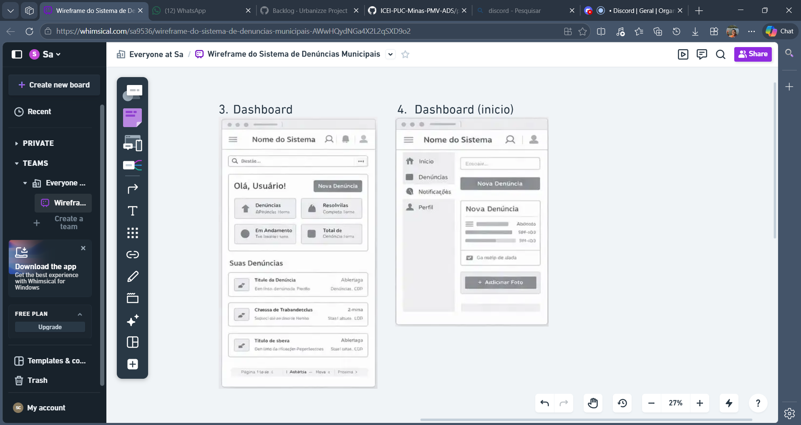
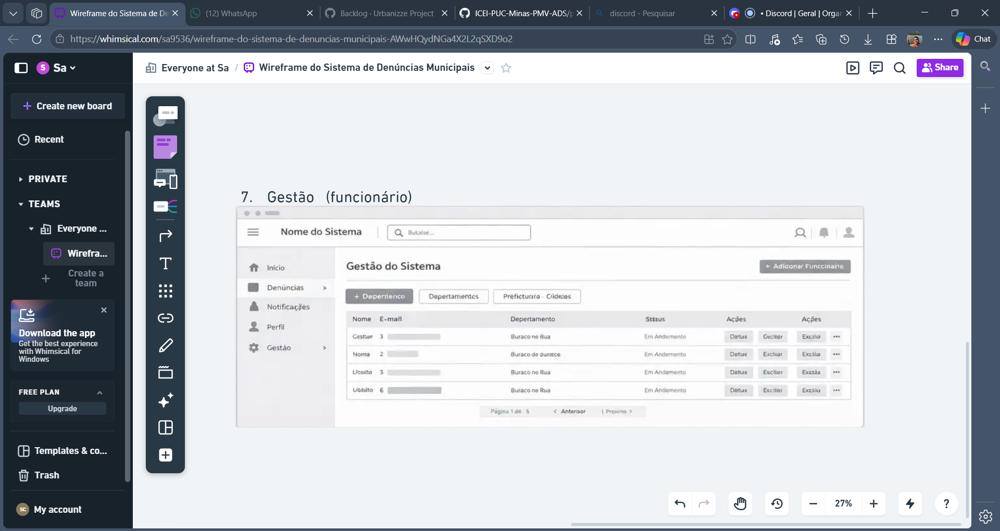

# Interfaces da Plataforma e Wireframes

A plataforma foi projetada com foco em **usabilidade**, **acessibilidade** e **eficiência**, garantindo que diferentes perfis de usuários (visitantes, cidadãos e funcionários) consigam interagir de forma simples e intuitiva.

O design das interfaces foi construído com base nos:
- Requisitos Funcionais (RF)
- Requisitos Não Funcionais (RNF)
- Histórias de Usuário

---

## Principais Interfaces do Sistema

### 1. Tela Inicial (Home)

**Descrição:**
- Permite acesso geral à plataforma
- Opções de navegação:
  - Visitante
  - Cidadão
  - Funcionário

**Requisitos atendidos:**
- RF-02 → Login
- RF-01 → Acesso geral
- RNF → Usabilidade e navegação simples

---

### 2. Exploração de Denúncias (Visitante)

**Descrição:**
- Visualização de denúncias públicas
- Filtros disponíveis:
  - Localização
  - Categoria
  - Status

**Requisitos atendidos:**
- RF → Consulta de denúncias públicas
- RNF → Performance de busca

---

### 3. Cadastro e Login

**Descrição:**
- Criação de conta
- Recuperação de senha
- Autenticação de usuário

**Requisitos atendidos:**
- RF-01 → Cadastro de cidadãos
- RF-02 → Login
- RF-03 → Recuperar senha
- RNF → Segurança de autenticação

---

### 4. Painel do Cidadão (Dashboard)

**Descrição:**
- Visualização das denúncias realizadas
- Ações disponíveis:
  - Criar nova denúncia
  - Acompanhar andamento
  - Editar perfil

**Requisitos atendidos:**
- RF → Gerenciar denúncias do cidadão
- RNF → Experiência do usuário

---

### 5. Formulário de Denúncia

**Descrição:**
- Campos obrigatórios:
  - Título
  - Descrição
  - Localização
- Upload de anexos (imagens/documentos)
- Opções de envio:
  - Anônimo
  - Identificado

**Requisitos atendidos:**
- RF → Registrar denúncia
- RNF → Facilidade de uso e acessibilidade

---

### 6. Detalhamento da Denúncia

**Descrição:**
- Exibição de:
  - Status da denúncia
  - Histórico
  - Comunicação (chat)
- Notificações em tempo real

**Requisitos atendidos:**
- RF → Acompanhar denúncia
- RF → Comunicação cidadão-funcionário
- RNF → Atualização em tempo real

---

### 7. Painel do Funcionário

**Descrição:**
- Lista de denúncias recebidas
- Filtros por prioridade/status
- Ações disponíveis:
  - Analisar
  - Encaminhar
  - Indeferir
  - Atualizar status

**Requisitos atendidos:**
- RF-06 → Gerenciar funcionários
- RF-07 → Gerenciar denúncias
- RNF → Eficiência operacional

---

### 8. Gestão Administrativa

**Descrição:**
- Gerenciamento de:
  - Departamentos
  - Funcionários

**Requisitos atendidos:**
- RF-04 → Gerenciar prefeituras/cidades
- RF-05 → Gerenciar departamentos
- RF-06 → Gerenciar funcionários

---

## Relação com o Diagrama de Fluxo

O diagrama de fluxo demonstra toda a jornada do usuário dentro do sistema, desde o acesso inicial até a finalização de uma denúncia.

**Importância:**
- Define a estrutura das telas
- Garante coerência na navegação
- Evita fluxos confusos
- Melhora a experiência do usuário

---

## Sobre os Wireframes

Os wireframes foram desenvolvidos com foco em:

- Estrutura clara das informações
- Navegação intuitiva
- Priorização das ações principais
- Redução da complexidade visual

**Cada wireframe representa:**
- Layout da interface
- Fluxo de interação do usuário
- Funcionalidades principais

---

## Conclusão

A modelagem das interfaces e wireframes foi baseada diretamente nos requisitos do sistema, garantindo que:

- Todas as funcionalidades estejam contempladas
- O sistema seja fácil de usar
- A navegação seja fluida
- A experiência do usuário seja eficiente

## wireframes

  

  

  

  

