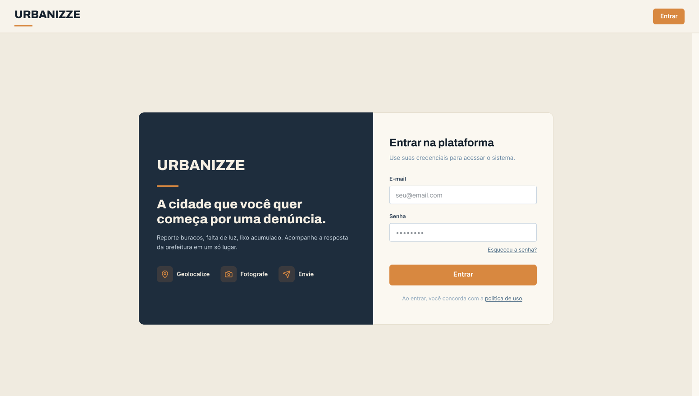
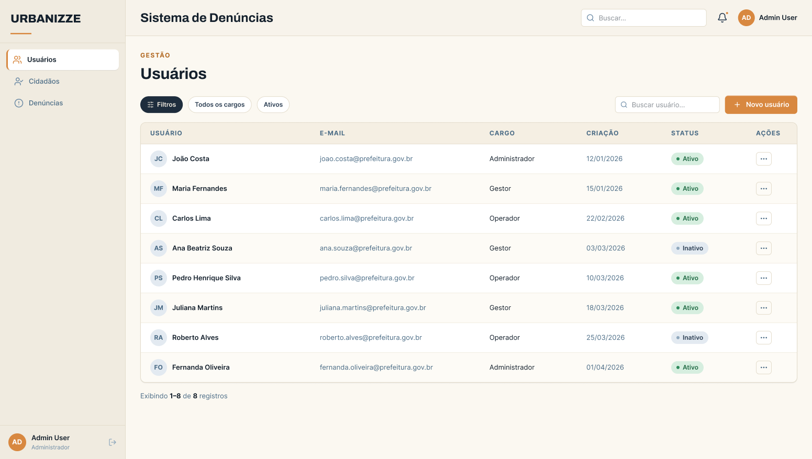
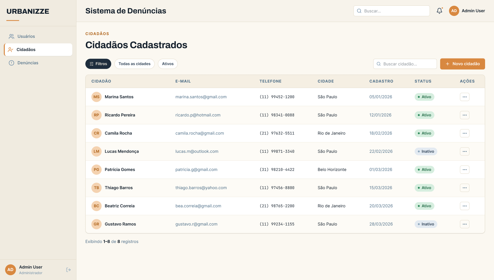
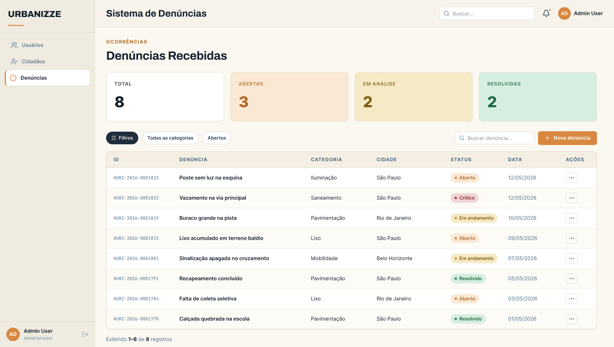
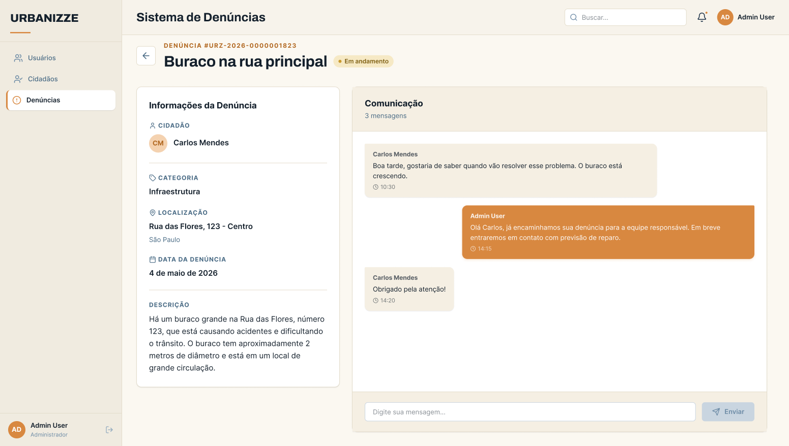
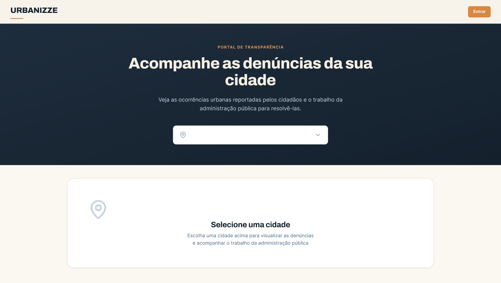
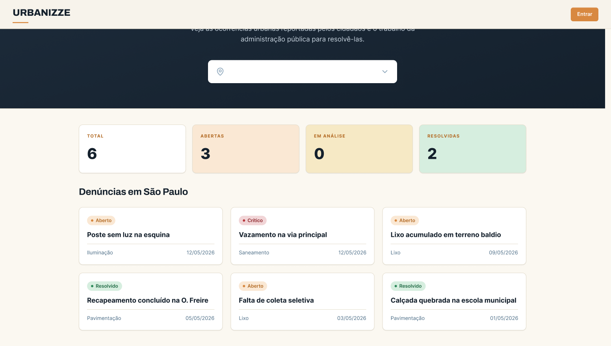

# Template Padrão da Aplicação

Layout padrão da aplicação que será utilizado em todas as páginas com a definição de identidade visual, aspectos de responsividade e iconografia.

## Tela - Login

Objetivo: Tela de login para acesso à aplicação.

- Campo de email: Permite ao usuário inserir seu endereço de email para autenticação.
- Campo de senha: Permite ao usuário inserir sua senha para autenticação.
- Botão de login: Permite ao usuário enviar suas credenciais para autenticação.
- Link de recuperação de senha: Permite ao usuário acessar a funcionalidade de recuperação de senha

## Tela - Usuários

Objetivo: Tela de gerenciamento de usuários.

- Lista de usuários: Exibe uma lista de usuários cadastrados na aplicação.
- Botão de adicionar usuário: Permite ao administrador adicionar um novo usuário.
- Botão de editar usuário: Permite ao administrador editar as informações de um usuário existente.
- Botão de excluir usuário: Permite ao administrador excluir um usuário da aplicação.
- Campo de pesquisa: Permite ao administrador pesquisar por usuários específicos na lista.

## Tela - Cidadãos

Objetivo: Tela de gerenciamento de cidadãos.

- Lista de cidadãos: Exibe uma lista de cidadãos cadastrados na aplicação.
- Botão de adicionar cidadão: Permite ao usuário adicionar um novo cidadão.
- Botão de editar cidadão: Permite ao usuário editar as informações de um cidadão existente.
- Botão de excluir cidadão: Permite ao usuário excluir um cidadão da aplicação.
- Campo de pesquisa: Permite ao usuário pesquisar por cidadãos específicos na lista.

## Tela - Denúncias

Objetivo: Tela de gerenciamento de denúncias.

- Lista de denúncias: Exibe uma lista de denúncias registradas na aplicação.
- Botão de adicionar denúncia: Permite ao usuário adicionar uma nova denúncia.
- Botão de editar denúncia: Permite ao usuário editar as informações de uma denúncia existente.
- Botão de excluir denúncia: Permite ao usuário excluir uma denúncia da aplicação.
- Campo de pesquisa: Permite ao usuário pesquisar por denúncias específicas na lista.

## Tela - Perfil da Denúncia

Objetivo: Tela de visualização detalhada de uma denúncia.

- Informações da denúncia: Exibe detalhes sobre a denúncia, como descrição, data, status, etc.
- Botão de editar denúncia: Permite ao usuário editar as informações da denúncia.
- Botão de excluir denúncia: Permite ao usuário excluir a denúncia da aplicação.
- Botão de voltar: Permite ao usuário retornar à lista de denúncias.

## Tela - Inicio

Objetivo: Tela inicial da aplicação.

- Portal transparencia: Exibe denúncias de acordo com o filtro de cidade
